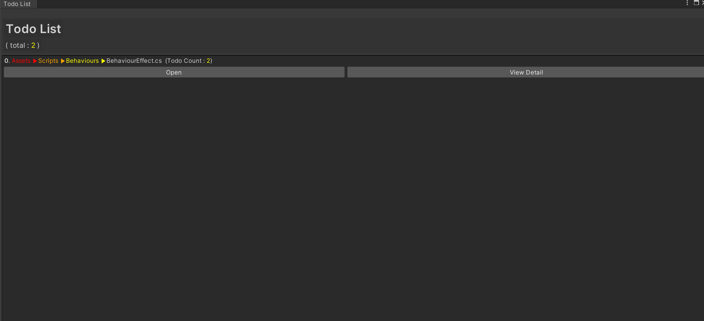

# Unity-Simple-TodoList

This is TodoList Manager.

## Usage

1. Goto Window/Todo List

2. As you can see, If Any Script in the Assets you could check the TodoAttributes.

   1. Open Button -> Open Script Editor.
   2. ViewDetail -> Content

3. In the Script.

   
